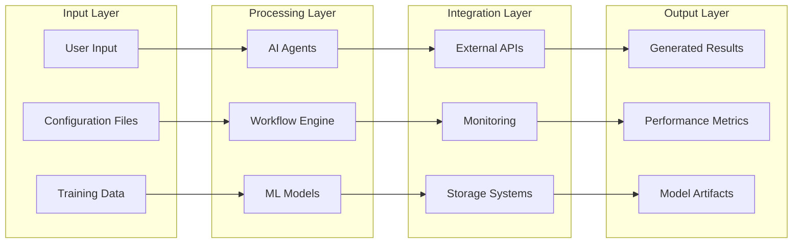

# AI Learning Journey - Project Architecture Visualization

## Project Overview
This repository is a comprehensive AI Engineering Study Guide containing tools, utilities, and educational materials for AI development, analysis, and cost optimization.

```mermaid
graph TB
    subgraph "AI Learning Journey Repository"
        direction TB
        
        subgraph "Core Infrastructure"
            HELPERS[helpers.py<br/>- Environment Management<br/>- API Key Handlers<br/>- Cost Analysis Functions]
            REQ[requirements.txt<br/>- Core Dependencies<br/>- ML/AI Libraries<br/>- Integration Tools]
            ROOT_NB[Root Notebooks<br/>- Introduction<br/>- Transformers<br/>- Diffusion Models<br/>- Audio Generation<br/>- RAG Systems]
        end
        
        subgraph "Deep Learning Foundations (dl120/)"
            DL120_NB[Core Notebooks<br/>- ImageNet Implementation<br/>- LeNet-5 Architecture<br/>- GPU Validation]
            VGG16[VGG16 Implementation<br/>- Model Architecture<br/>- Training Pipeline<br/>- CLI Interface<br/>- Metrics Tracking]
            DL120_SCRIPTS[Python Scripts<br/>- ImageNet Processing<br/>- Data Downloads]
        end
        
        subgraph "AI Agents & Workflows (crewai-examples/)"
            CREWAI_CORE[CrewAI Examples<br/>- Multi-Agent Systems<br/>- Workflow Automation<br/>- Task Coordination]
            CREWAI_APPS[Business Applications<br/>- Email Auto-Responder<br/>- Marketing Strategy<br/>- Job Posting<br/>- Stock Analysis<br/>- Trip Planning]
            CREWAI_FLOWS[Advanced Flows<br/>- Self-Evaluation Loops<br/>- Meeting Assistants<br/>- Lead Scoring]
            LANGGRAPH_INT[LangGraph Integration<br/>- State Management<br/>- Graph-based Workflows<br/>- Node Orchestration]
        end
        
        subgraph "Educational Content"
            COURSES[Course Materials<br/>- Diffusion Course<br/>- 3D Generation<br/>- Audio Generation<br/>- HuggingFace Notebooks<br/>- LLM Course<br/>- MCP Course]
            TUTORIALS[Interactive Tutorials<br/>- 500+ Jupyter Notebooks<br/>- Code Examples<br/>- Hands-on Exercises]
        end
        
        subgraph "Advanced AI Systems"
            INFERENCE[Inference Examples<br/>- Model Serving<br/>- Optimization<br/>- Performance Tuning]
            FINETUNING[Fine-tuning Examples<br/>- PEFT Methods<br/>- LoRA Training<br/>- DreamBooth<br/>- Quantization]
            EVALUATION[Evaluation Framework<br/>- Agent Testing<br/>- Performance Metrics<br/>- Benchmarking]
        end
        
        subgraph "Platform Integrations"
            E2B[E2B Code Interpreter<br/>- Sandboxed Execution<br/>- Multiple AI Models<br/>- Real-time Coding]
            LIVEKIT[LiveKit Demos<br/>- Real-time AI<br/>- Voice/Video<br/>- Interactive Systems]
            FASTRTC[FastRTC Demos<br/>- Real-time Communication<br/>- Audio/Video AI<br/>- Live Interactions]
        end
        
        subgraph "Development Tools"
            COMFYUI[ComfyUI Templates<br/>- 300+ Workflow Templates<br/>- Image Generation<br/>- Video Processing<br/>- API Integrations]
            N8N[N8N Workflows<br/>- 400+ Automation Workflows<br/>- API Orchestration<br/>- Business Process Automation]
            DISTRIBUTED[Distributed AI<br/>- Federated Learning<br/>- Multi-device Training<br/>- Edge Deployment]
        end
        
        subgraph "Memory & State Management"
            MEMGPT[MemGPT Notebooks<br/>- Agent Memory<br/>- Long-term Context<br/>- Conversational AI]
            LLAMAINDEX[LlamaIndex Examples<br/>- Document Management<br/>- Vector Stores<br/>- Knowledge Graphs]
            LANGGRAPH_EX[LangGraph Examples<br/>- State Persistence<br/>- Multi-agent Coordination<br/>- Complex Workflows]
        end
    end
    
    subgraph "External Dependencies & APIs"
        OPENAI[OpenAI API<br/>- GPT Models<br/>- DALL-E<br/>- Embeddings]
        HF[Hugging Face<br/>- Model Hub<br/>- Transformers<br/>- Datasets]
        TAVILY[Tavily<br/>- Web Search<br/>- Information Retrieval]
        E2B_CLOUD[E2B Cloud<br/>- Sandboxed Execution<br/>- Code Interpreter]
        PHOENIX[Arize Phoenix<br/>- AI Observability<br/>- Performance Monitoring]
    end
    
    %% Connections
    HELPERS --> OPENAI
    HELPERS --> HF
    HELPERS --> TAVILY
    REQ --> E2B_CLOUD
    REQ --> PHOENIX
    
    CREWAI_CORE --> LANGGRAPH_INT
    E2B --> E2B_CLOUD
    EVALUATION --> PHOENIX
    VGG16 --> HF
    FINETUNING --> HF
    
    classDef coreInfra fill:#e1f5fe
    classDef aiAgents fill:#f3e5f5
    classDef education fill:#e8f5e8
    classDef advanced fill:#fff3e0
    classDef integration fill:#fce4ec
    classDef tools fill:#f1f8e9
    classDef memory fill:#e0f2f1
    classDef external fill:#fafafa
    
    class HELPERS,REQ,ROOT_NB coreInfra
    class CREWAI_CORE,CREWAI_APPS,CREWAI_FLOWS,LANGGRAPH_INT aiAgents
    class COURSES,TUTORIALS education
    class INFERENCE,FINETUNING,EVALUATION advanced
    class E2B,LIVEKIT,FASTRTC integration
    class COMFYUI,N8N,DISTRIBUTED tools
    class MEMGPT,LLAMAINDEX,LANGGRAPH_EX memory
    class OPENAI,HF,TAVILY,E2B_CLOUD,PHOENIX external
```

## Detailed Component Analysis

### 1. Core Infrastructure Layer
- **helpers.py**: Centralized utility functions for environment management, API authentication, and cost analysis
- **requirements.txt**: Comprehensive dependency management with version pinning
- **Root Notebooks**: Foundation-level educational content covering key AI concepts

### 2. Deep Learning Foundations (dl120/)
**Technical Implementation:**
- Complete VGG16 implementation with modular architecture
- Training pipeline with checkpointing and early stopping
- CLI interface for model training and inference
- Comprehensive metrics tracking and evaluation
- GPU optimization and validation utilities

**Key Files:**
- `dl120/vgg16/models/vgg16.py`: Core model architecture
- `dl120/vgg16/training/trainer.py`: Training orchestration
- `dl120/vgg16/cli/main.py`: Command-line interface

### 3. AI Agents & Workflows (crewai-examples/)
**Architecture:**
- **Multi-Agent Systems**: Coordinated agent workflows for complex tasks
- **Business Applications**: Production-ready examples for real-world scenarios
- **LangGraph Integration**: State-based workflow management
- **Configuration Management**: YAML-based agent and task definitions

**Technical Features:**
- Agent role specialization and task delegation
- Inter-agent communication protocols
- Workflow state persistence
- Error handling and retry mechanisms

### 4. Platform Integrations
**E2B Integration** (20+ examples):
- Sandboxed code execution environment
- Support for multiple AI models (OpenAI, Claude, Groq, etc.)
- Real-time code interpretation and visualization

**LiveKit/FastRTC** (30+ demos):
- Real-time voice and video AI applications
- Low-latency communication systems
- Multi-modal AI interactions

### 5. Advanced AI Systems
**Fine-tuning Framework** (100+ examples):
- PEFT methods (LoRA, QLoRA, AdaLoRA)
- DreamBooth implementations
- Quantization techniques
- Multi-adapter inference

**Evaluation System**:
- Comprehensive agent evaluation framework
- Performance benchmarking tools
- Observability and monitoring integration

### 6. Development Tools
**ComfyUI Templates** (300+ workflows):
- Complete image/video generation pipelines
- API integrations for major AI services
- Production-ready workflow templates

**N8N Automations** (400+ workflows):
- Business process automation
- API orchestration and integration
- Multi-service workflow coordination

## Data Flow Architecture

## Technology Stack

### Core Dependencies
- **SmolAgents**: Multi-agent orchestration and telemetry
- **E2B**: Sandboxed code execution environment
- **OpenAI**: LLM and multimodal AI capabilities
- **Tavily**: Web search and information retrieval
- **Arize Phoenix**: AI observability and monitoring

### ML/AI Libraries
- **Transformers**: State-of-the-art NLP models
- **Diffusers**: Diffusion model implementations
- **PEFT**: Parameter-efficient fine-tuning
- **Datasets**: Data loading and processing

### Visualization & Analysis
- **Plotly**: Interactive visualizations
- **Pandas/NumPy**: Data manipulation and analysis
- **Jupyter**: Interactive development environment

## Scalability & Performance

### Distributed Training Support
- Federated learning implementations
- Multi-device training coordination
- Edge deployment examples

### Performance Optimization
- Model quantization techniques
- Inference optimization strategies
- Memory-efficient training methods

### Monitoring & Observability
- Real-time performance tracking
- Cost analysis and optimization
- Error tracking and alerting

## Security & Best Practices

### Environment Management
- Centralized API key handling
- Environment variable isolation
- Secure configuration patterns

### Code Quality
- Modular architecture design
- Comprehensive error handling
- Extensive documentation and examples

This architecture provides a comprehensive foundation for AI engineering education, research, and production deployment, with particular strengths in agent-based systems, distributed training, and real-time AI applications.