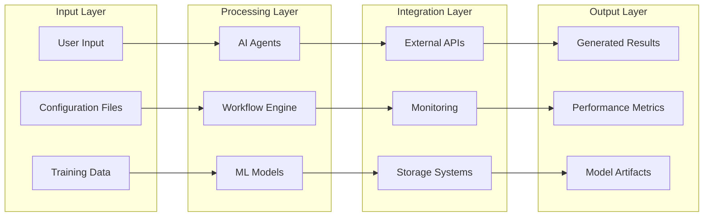

# AI Learning Journey - Project Architecture Visualization

## Project Overview
This repository is a comprehensive AI Engineering Study Guide containing tools, utilities, and educational materials for AI development, analysis, and cost optimization.

```mermaid
graph TB
    subgraph MAIN ["AI Learning Journey Repository"]
        direction TB
        
        subgraph CORE ["Core Infrastructure"]
            HELPERS["helpers.py<br/>- Environment Management<br/>- API Key Handlers<br/>- Cost Analysis Functions"]
            REQ["requirements.txt<br/>- Core Dependencies<br/>- ML/AI Libraries<br/>- Integration Tools"]
            ROOT_NB["Root Notebooks<br/>- Introduction<br/>- Transformers<br/>- Diffusion Models<br/>- Audio Generation<br/>- RAG Systems"]
        end
        
        subgraph DL_FOUND ["Deep Learning Foundations"]
            DL120["DL120 Original<br/>- VGG16 Implementation<br/>- Basic Architecture Study"]
            DEEPL20["DeepLearning20<br/>- 20 Key Architectures<br/>- 120-Day Journey<br/>- AlexNet, BERT, GAN<br/>- LSTM, ResNet50, ViT"]
        end
        
        subgraph EDU ["Educational Content"]
            CV_COURSE["Computer Vision Course<br/>- 13 Comprehensive Units<br/>- CNN to Transformers<br/>- Multimodal Models<br/>- Ethics and Bias"]
            COURSES["Specialized Courses<br/>- 3D Generation<br/>- Audio Generation<br/>- Diffusion Models<br/>- Language Models<br/>- Reinforcement Learning"]
            GEMMA_NB["Gemma Notebooks<br/>- 80+ Implementation Examples<br/>- All Gemma Variants<br/>- PaliGemma Vision<br/>- CodeGemma"]
        end
        
        subgraph ADV ["Advanced AI Systems"]
            QUANTIZATION["Quantization Examples<br/>- 22+ Practical Notebooks<br/>- GPTQ, GGUF, HQQ<br/>- Multi-modal Quantization<br/>- Production Optimization"]
            FINETUNING["Fine-tuning Suite<br/>- PEFT Methods<br/>- LoRA, DreamBooth<br/>- Stable Diffusion<br/>- Unsloth Integration"]
            INFERENCE_NB["Inference Notebooks<br/>- Chat Templates<br/>- Multi-language Support<br/>- Runtime Optimization<br/>- Monitoring and Serving"]
        end
        
        subgraph RT ["Real-time AI"]
            FASTRTC["FastRTC Demos 25+<br/>- Voice Assistants<br/>- Real-time Communication<br/>- Multi-modal AI<br/>- Patient Intake Systems"]
            LIVEKIT_NB["LiveKit Notebooks<br/>- Avatar Agents<br/>- Voice Agents<br/>- Real-time Primitives"]
        end
        
        subgraph AGENTS ["Agent Frameworks"]
            LANGGRAPH_NB["LangGraph Notebooks<br/>- Multi-agent Systems<br/>- RAG Implementations<br/>- Code Assistants<br/>- Customer Support"]
            LLAMAINDEX_NB["LlamaIndex Notebooks<br/>- Document Management<br/>- Vector Stores<br/>- Graph RAG<br/>- Workflow Systems"]
            SMOLAGENTS_NB["SmolAgents Course<br/>- Agent Basics<br/>- Tool Integration<br/>- Multi-agent Coordination"]
        end
        
        subgraph TOOLS ["Integration and Tools"]
            EVALUATION["Evaluation Framework<br/>- Agent Comparison<br/>- Code Generation Agents<br/>- RAG Evaluation<br/>- Computer Use Agents"]
            OPENSOURCE_NB["Open Source Notebooks<br/>- RAG Systems<br/>- Fine-tuning Examples<br/>- Enterprise Cookbooks<br/>- Production Patterns"]
            PROMPTS["Prompt Engineering<br/>- Cursor Prompts<br/>- Agent Tools<br/>- Foundation Prompts<br/>- VSCode Integration"]
        end
        
        subgraph SPEC ["Specialized Applications"]
            SIMULATION["Simulation Environment<br/>- MuJoCo Integration<br/>- Isaac Gym<br/>- Robotics Training<br/>- Vision Models"]
            TRANSFORMERS_NB["Transformers Notebooks<br/>- 50+ Model Architectures<br/>- BERT to Flux<br/>- Vision and Language<br/>- Multimodal Models"]
            OLLAMA_EX["Ollama Python Examples<br/>- Local Model Serving<br/>- Structured Outputs<br/>- Tool Integration<br/>- Async Operations"]
        end
    end
    
    subgraph EXT ["External Dependencies"]
        OPENAI["OpenAI API<br/>- GPT Models<br/>- DALL-E<br/>- Embeddings"]
        HF["Hugging Face<br/>- Model Hub<br/>- Transformers<br/>- Datasets"]
        TAVILY["Tavily<br/>- Web Search<br/>- Information Retrieval"]
        E2B_CLOUD["E2B Cloud<br/>- Sandboxed Execution<br/>- Code Interpreter"]
        PHOENIX["Arize Phoenix<br/>- AI Observability<br/>- Performance Monitoring"]
    end
    
    %% Connections
    HELPERS --> OPENAI
    HELPERS --> HF
    HELPERS --> TAVILY
    REQ --> E2B_CLOUD
    REQ --> PHOENIX
    EVALUATION --> PHOENIX
    FINETUNING --> HF
    QUANTIZATION --> HF
    
    classDef coreInfra fill:#e1f5fe,stroke:#01579b,stroke-width:2px
    classDef education fill:#e8f5e8,stroke:#2e7d32,stroke-width:2px
    classDef advanced fill:#fff3e0,stroke:#ef6c00,stroke-width:2px
    classDef integration fill:#fce4ec,stroke:#c2185b,stroke-width:2px
    classDef external fill:#fafafa,stroke:#424242,stroke-width:2px
    
    class HELPERS,REQ,ROOT_NB coreInfra
    class CV_COURSE,COURSES,GEMMA_NB,DL120,DEEPL20 education
    class QUANTIZATION,FINETUNING,INFERENCE_NB advanced
    class FASTRTC,LIVEKIT_NB,EVALUATION,OPENSOURCE_NB,PROMPTS integration
    class OPENAI,HF,TAVILY,E2B_CLOUD,PHOENIX external
```

## Detailed Component Analysis

### 1. Core Infrastructure Layer
- **helpers.py**: Centralized utility functions for environment management, API authentication, and cost analysis
- **requirements.txt**: Comprehensive dependency management with version pinning
- **Root Notebooks**: Foundation-level educational content covering key AI concepts

### 2. Deep Learning Foundations
**DL120 (Original):**
- VGG16 implementation with basic architecture study
- Single model deep-dive approach

**DeepLearning20 (New):**
- **120-Day Learning Journey**: Comprehensive study of 20 key architectures
- **Complete Architecture Coverage**: AlexNet, BERT, DDPM, GAN, GPT2, LSTM, ResNet50, ViT, YOLO, etc.
- **Modular Implementation**: Each architecture with dedicated structure
- **Technical Implementation**: Training pipelines, CLI interfaces, metrics tracking
- **Key Files**: `deeplearning20/AlexNet/`, `deeplearning20/BERT/`, etc.

### 3. Educational Content Ecosystem
**Computer Vision Course (13 Units):**
- Complete progression from fundamentals to ethics
- CNN architectures to Vision Transformers
- Multimodal models and generative systems
- 3D vision and model optimization

**Specialized Courses:**
- 3D Generation with hands-on exercises
- Audio Generation with pipeline tutorials
- Diffusion Models with custom implementations
- Language Models with comprehensive coverage
- Reinforcement Learning fundamentals
- SmolAgents framework training

**Gemma Ecosystem (80+ Notebooks):**
- Complete Gemma family coverage
- PaliGemma vision applications
- CodeGemma development tools
- Fine-tuning and deployment examples

### 4. Advanced AI Systems
**Quantization Suite (22+ Notebooks):**
- **Production-Ready**: GPTQ, GGUF, HQQ implementations
- **Multi-modal Support**: Audio (Whisper), Vision (Llava, Phi-3), Text models
- **Performance Optimization**: Memory reduction, speed improvements
- **Deployment Focus**: Serving frameworks (vLLM, SGLang)

**Fine-tuning Framework:**
- PEFT methods (LoRA, QLoRA, AdaLoRA, DoRA)
- Stable Diffusion fine-tuning
- Unsloth integration for efficiency
- Multi-adapter inference patterns

**Inference Optimization:**
- Chat template systems
- Multi-language runtime support
- Monitoring and observability
- Production serving patterns

### 5. Real-time AI & Communication
**FastRTC Demos (25+ Applications):**
- Voice assistants with multiple providers (OpenAI, Claude, Gemini)
- Real-time transcription and translation
- Multi-modal interactions (audio + video)
- Specialized applications (patient intake, code editing)
- WebRTC vs WebSocket comparisons

**LiveKit Integration:**
- Avatar-based interactions
- Voice agent primitives
- Real-time communication protocols

### 6. Agent Frameworks & Workflows
**LangGraph Notebooks:**
- Multi-agent coordination systems
- RAG implementations with state management
- Code assistant workflows
- Customer support automation
- Advanced reasoning patterns (ReflExion, LATS)

**LlamaIndex Suite:**
- Document management systems
- Vector store integrations
- Graph RAG implementations
- Workflow orchestration

**SmolAgents Course:**
- Agent fundamentals and best practices
- Tool integration patterns
- Multi-agent coordination strategies

### 7. Integration & Development Tools
**Evaluation Framework:**
- Agent performance comparison
- Code generation benchmarking
- RAG system evaluation
- Computer use agent testing

**Open Source Notebooks:**
- Enterprise cookbook patterns
- RAG system implementations
- Fine-tuning production examples
- MLOps integration patterns

**Prompt Engineering Suite:**
- Cursor IDE integration
- Agent tool configurations
- Foundation model prompts
- VSCode development patterns

## Data Flow Architecture

## Technology Stack

### Core Dependencies
- **SmolAgents**: Multi-agent orchestration and telemetry
- **E2B**: Sandboxed code execution environment
- **OpenAI**: LLM and multimodal AI capabilities
- **Tavily**: Web search and information retrieval
- **Arize Phoenix**: AI observability and monitoring

### ML/AI Libraries
- **Transformers**: State-of-the-art NLP models
- **Diffusers**: Diffusion model implementations
- **PEFT**: Parameter-efficient fine-tuning
- **Datasets**: Data loading and processing
- **Quantization Tools**: GPTQ, GGUF, HQQ, vLLM, SGLang
- **Fine-tuning Frameworks**: Unsloth, TRL, Axolotl

### Visualization & Analysis
- **Plotly**: Interactive visualizations
- **Pandas/NumPy**: Data manipulation and analysis
- **Jupyter**: Interactive development environment

### Real-time & Communication
- **FastRTC**: Real-time communication protocols
- **LiveKit**: Voice and video AI frameworks
- **WebRTC/WebSocket**: Communication infrastructure

### Development & Integration
- **LangGraph**: Workflow orchestration and state management
- **LlamaIndex**: Document processing and RAG systems
- **Ollama**: Local model serving and management

## Scalability & Performance

### Distributed Training Support
- Federated learning implementations
- Multi-device training coordination
- Edge deployment examples

### Performance Optimization
- Model quantization techniques
- Inference optimization strategies
- Memory-efficient training methods

### Monitoring & Observability
- Real-time performance tracking
- Cost analysis and optimization
- Error tracking and alerting

## Security & Best Practices

### Environment Management
- Centralized API key handling
- Environment variable isolation
- Secure configuration patterns

### Code Quality
- Modular architecture design
- Comprehensive error handling
- Extensive documentation and examples

## Major Updates and Additions

### Removed Components
- **crewai-examples/**: Multi-agent CrewAI examples (previously 25+ examples)
- **comfyui-templates/**: Image/video generation workflows (previously 300+ templates)
- **n8n-workflows/**: Business process automation (previously 400+ workflows)
- **huggingface-notebooks/**: Core HF educational content
- **distributed-ai-examples/**: Federated learning examples
- **memgpt-notebooks/**: Agent memory management
- **livekit-examples/**: Real-time AI demos

### New/Expanded Components
- **deeplearning20/**: Complete 20-architecture study program
- **quantization-examples/**: Production-ready quantization suite (22+ notebooks)
- **gemma-notebooks/**: Comprehensive Gemma family coverage (80+ notebooks)
- **cv-course/**: Complete 13-unit computer vision curriculum
- **inference-notebooks/**: Advanced inference optimization
- **langgraph-notebooks/**: Multi-agent workflow systems
- **llamaindex-notebooks/**: Document processing and RAG
- **smolagents-course/**: Agent framework training
- **opensource-ai-notebooks/**: Enterprise patterns and cookbooks
- **ollama-python-examples/**: Local model serving
- **simulation/**: Robotics and training environments
- **transformers-notebooks/**: 50+ transformer architectures
- **promts-examples/**: IDE integration and prompt engineering

### Architectural Evolution
This updated architecture represents a significant evolution toward:
- **Production-Ready Systems**: Focus on quantization, inference optimization, and deployment
- **Educational Depth**: Comprehensive courses replacing scattered examples  
- **Agent Framework Integration**: Multiple agent systems (LangGraph, LlamaIndex, SmolAgents)
- **Real-world Applications**: Enterprise patterns, simulation environments, and practical implementations
- **Local-First Approach**: Ollama integration, local serving, and privacy-focused solutions

This architecture now provides a more structured, production-oriented foundation for AI engineering education, research, and deployment, with particular strengths in agent-based systems, quantization optimization, and comprehensive educational pathways.

## Setup

1. Clone the repository
2. Install dependencies:

